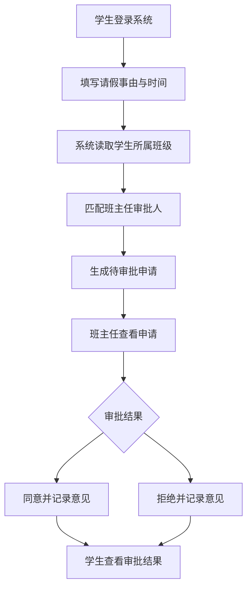
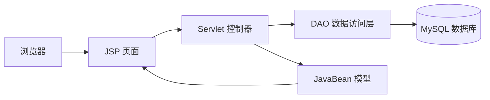
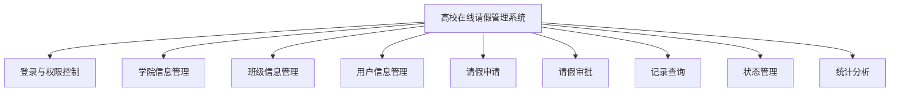
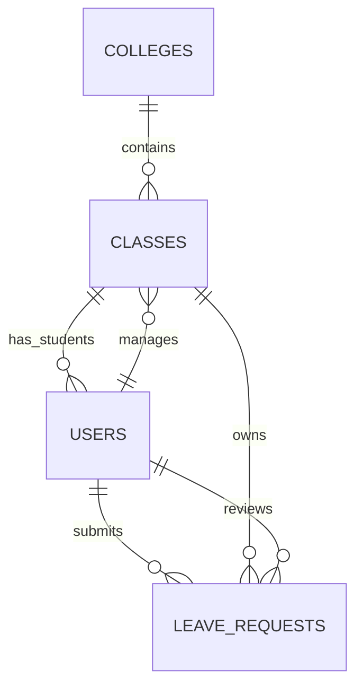

# Java EE 编程基础实训报告

## 一、项目概述

项目名称：高校在线请假管理系统。

本系统面向高校学生日常请假场景，解决纸质请假流程效率低、记录不便查询、班主任审批信息分散等问题。系统采用 Java EE Web 技术实现，使用 Servlet 处理请求，JSP 展示页面，JavaBean 封装实体，JDBC 完成数据库访问，整体结构符合 MVC 分层思想。

## 二、需求分析

系统角色包括管理员、班主任和学生。

管理员负责学院信息、班级信息、用户信息维护，并可查询全校请假记录、维护请假状态、查看统计结果。

学生登录系统后可以提交请假申请，填写请假事由、开始时间、结束时间。系统根据学生所属班级自动确定审批人，即班级对应班主任。学生可以查询本人请假记录及审批结果。

班主任登录后可以查看本班学生提交的待审批申请，填写审批意见并执行同意或拒绝操作。班主任也可以按学生、班级、时间和状态查询历史审批记录。

核心用例包括登录、基础信息管理、请假申请、请假审批、记录查询、状态管理和统计分析。

## 三、系统设计

系统采用 MVC 模式：

- Model：`User`、`College`、`ClassInfo`、`LeaveRequest` 等 JavaBean。
- View：JSP 页面负责表单展示、列表展示和统计结果展示。
- Controller：Servlet 接收请求并调用 DAO 完成业务处理。
- DAO：使用 JDBC 和 PreparedStatement 完成数据库增删改查。

功能模块划分如下：

## 四、数据库设计

主要实体包括学院、班级、用户和请假申请。学院与班级是一对多关系，班级与学生是一对多关系，班级与班主任存在审批关系，学生提交的请假申请由对应班主任审批。

主要数据表：

| 表名 | 说明 |
| --- | --- |
| `colleges` | 学院信息，包含学院编号和学院名称 |
| `classes` | 班级信息，包含所属学院、班级名称和班主任 |
| `users` | 用户信息，包含管理员、班主任、学生 |
| `leave_requests` | 请假申请，包含请假事由、时间、审批人、状态和审批意见 |

## 五、系统实现

登录模块通过 `AuthServlet` 查询用户表，登录成功后将当前用户保存到 Session。`AuthFilter` 负责拦截未登录访问，`EncodingFilter` 统一处理 UTF-8 编码。

基础信息管理模块包括 `CollegeServlet`、`ClassServlet` 和 `UserServlet`。管理员可以新增、查询、修改和删除学院、班级和用户信息。

请假申请模块由 `LeaveRequestServlet` 实现。学生提交申请时，系统根据学生 `class_id` 查询班级信息，再读取班主任 `head_teacher_id` 作为审批人，生成状态为 `PENDING` 的请假记录。

审批模块由 `ApprovalServlet` 实现。班主任只能查看和处理与自己关联的申请，审批后系统记录状态、审批意见和审批时间。

统计模块由 `StatsServlet` 实现，支持按班级和状态统计请假次数及请假天数。

## 六、测试用例

| 编号 | 测试内容 | 输入数据 | 预期结果 |
| --- | --- | --- | --- |
| TC01 | 用户登录 | admin/admin123 | 登录成功并进入系统首页 |
| TC02 | 学院新增 | AI/人工智能学院 | 学院列表显示新增数据 |
| TC03 | 班级新增 | 人工智能2301班，班主任张老师 | 班级保存成功并能查询 |
| TC04 | 学生提交请假 | 事由、开始时间、结束时间 | 生成待审批记录 |
| TC05 | 班主任审批通过 | 审批意见“同意” | 状态变为已通过 |
| TC06 | 班主任审批拒绝 | 审批意见“不符合请假要求” | 状态变为已拒绝 |
| TC07 | 按状态查询 | 状态=待审批 | 只显示待审批记录 |
| TC08 | 统计查询 | 指定班级和日期范围 | 显示该范围内请假次数和天数 |

## 七、总结

本项目完成了指导书要求的 Java EE Web 系统开发流程，包括选题分析、需求分析、系统设计、数据库设计、系统实现和测试说明。系统功能覆盖高校在线请假管理的主要业务流程，具有清晰的角色权限划分和完整的数据流转过程。通过本项目，进一步熟悉了 Servlet、JSP、JavaBean、JDBC、MVC 分层设计和 MySQL 数据库应用。
